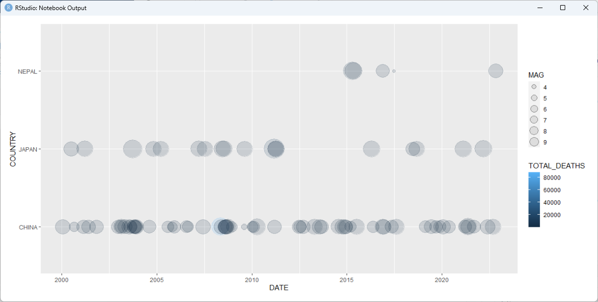
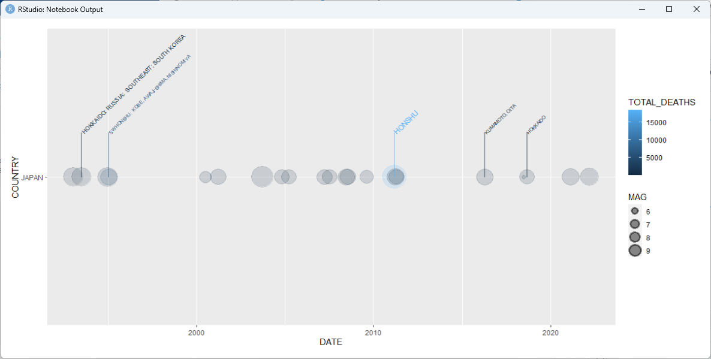
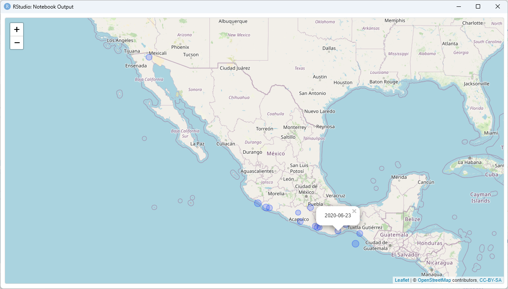
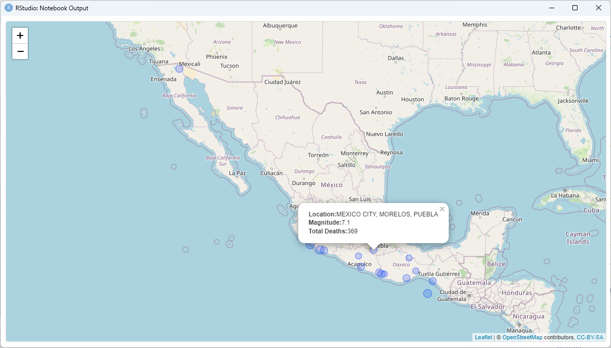

<!-- README.md is generated from README.Rmd. Please edit that file -->

# README

<!-- badges: start -->


<!-- badges: end -->

This NOAA Earthquake package contains data on significant earthquakes
from 2150 B.C. to the present (May2023) provided by the National Centers
For Environmental Information on <https://www.ngdc.noaa.gov>. The
tab-delimited data were downloaded as a TSV (tab separated value) file
(‘earthquakes.tsv’) from the [NCEI/WDS Global Significant Earthquake
Database](https://www.ngdc.noaa.gov/hazel/view/hazards/earthquake/search).

This package contains functions to read and clean the data, geoms to
visualize and label earthquakes on a timeline, and functions to display
and label earthquakes on a map.

# Installation

You can install this R package from GitHub using devtools:

``` r
library(devtools)
install_github("ByronMattingly2015/NOAAEarthquakes")
```

# Usage

Packages relevant for these examples:

``` r
library(NOAAEarthquakes)
library(tidyverse)
library(leaflet)
```

## Included data

Data files included within the package are:

``` r
list.files(system.file("extdata", package = "NOAAEarthquakes"))
#> [1] "earthquakes.tsv"
```

## Reading/Cleaning Data

- eq_read_data() - reads a TSV data file into a data frame and formats
  some of the columns
- eq_location_clean() - splits the `LOCATION` column into `COUNTRY` and
  `REGION` columns
- eq_clean_data() - uses lubridate to form a `DATE` column from the
  `YEAR`,`MONTH`,`DAY` columns in the TSV data file

Viewing the 5 most deadly earthquakes since the year 2000:

``` r
data <- eq_clean_data() %>% 
    dplyr::filter(!is.na(TOTAL_DEATHS)) %>% 
    dplyr::select(DATE, YEAR, COUNTRY, REGION, LONGITUDE, LATITUDE, MAG, TOTAL_DEATHS) %>%
  tidyr::drop_na()
data %>% 
  dplyr::filter(YEAR > 1999) %>%
  dplyr::arrange(desc(TOTAL_DEATHS)) %>%
                   head(n = 5)
#> # A tibble: 5 x 8
#>   DATE       YEAR  COUNTRY   REGION        LONGITUDE LATITUDE   MAG TOTAL_DEATHS
#>   <date>     <chr> <chr>     <chr>             <dbl>    <dbl> <dbl>        <dbl>
#> 1 2010-01-12 2010  HAITI     PORT-AU-PRIN~     -72.5    18.5    7         316000
#> 2 2004-12-26 2004  INDONESIA SUMATRA:  AC~      95.9     3.32   9.1       227899
#> 3 2008-05-12 2008  CHINA     SICHUAN PROV~     103.     31.0    7.9        87652
#> 4 2005-10-08 2005  PAKISTAN  MUZAFFARABAD~      73.6    34.5    7.6        76213
#> 5 2003-12-26 2003  IRAN      SOUTHEASTERN~      58.3    29.0    6.6        31000
```

## Custom ggplot2 Layers

### Timeline

This package includes *geom_timeline()* which adds custom layers to
ggplot for visualizing Earthquakes on a timeline.

For example, here’s how to plot a timeline of deadly earthquakes in 3
different countries:

``` r
data %>% dplyr::filter(YEAR > 1999,
                       COUNTRY %in% c("JAPAN", "CHINA","NEPAL")) %>%
    ggplot2::ggplot() +
    geom_timeline(aes(x = DATE,
                      y = COUNTRY,
                      size = MAG,
                      color = TOTAL_DEATHS))
```


### Annotated Timeline

*geom_timeline_label()* can be used to draw labels with markers (line
segments) by adding layers to ggplot.

Labeling the 5 most deadly earthquakes in JAPAN since 1990 by Magnitude:

``` r
data %>% dplyr::filter(COUNTRY == "JAPAN", 
                              YEAR >= 1990) %>%
  ggplot2::ggplot(aes(x = DATE,
                      y = COUNTRY,
                      size = MAG,
                      color = TOTAL_DEATHS,
                      label = REGION,
                      mag = TOTAL_DEATHS)) +
  geom_timeline() +
  geom_timeline_label(aes(n_max = 5))
```
 \##
Leaflet Maps

*eq_map()* uses the `leaflet` package to generate maps and takes one
argument `annot_col` that specifies the column to use for annotation (by
default `annot_col = DATE`) which is displayed as pop-up text over a
circle centered at each coordinate. For a dataframe with the columns
`LONGITUDE`, `LATITUDE`, `MAG`, `annot_col` displays this information in
the pop-up text instead.

Plot the epicenters on a leaflet map:

``` r
data %>% 
  dplyr::filter(COUNTRY == "MEXICO", 
                YEAR >= 2000) %>% 
  eq_map(annot_col = "DATE")
```

 Used in
conjunction with *eq_map()*, *eq_create_label()* generates a fancier
HTML label.

``` r
data %>% 
  dplyr::filter(COUNTRY == "MEXICO",
                YEAR >= 2000) %>% 
  dplyr::mutate(popup_text = eq_create_label(.)) %>% 
  eq_map(annot_col = "popup_text")
```


